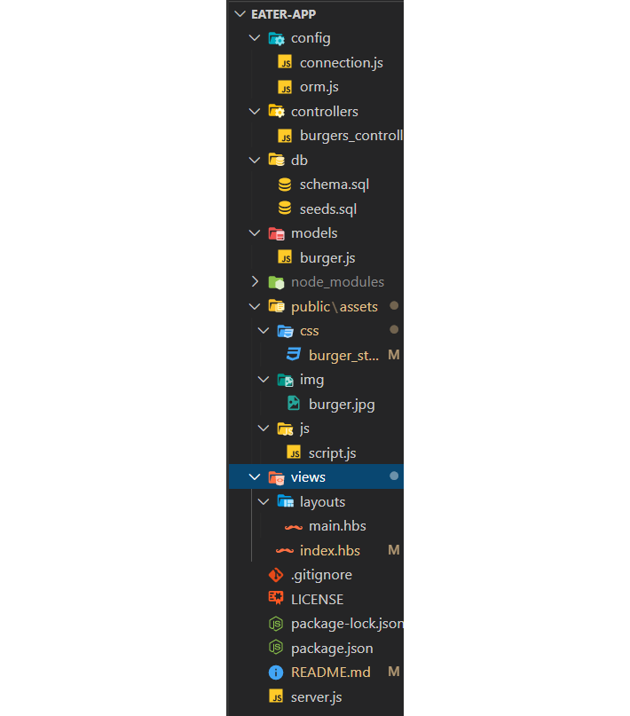
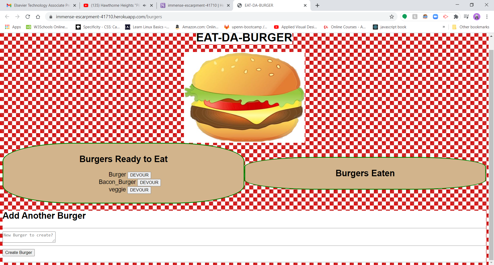
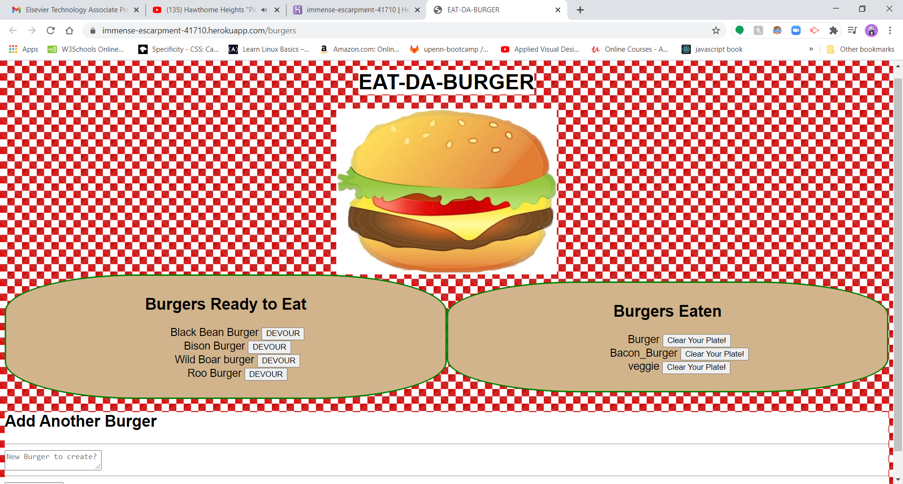
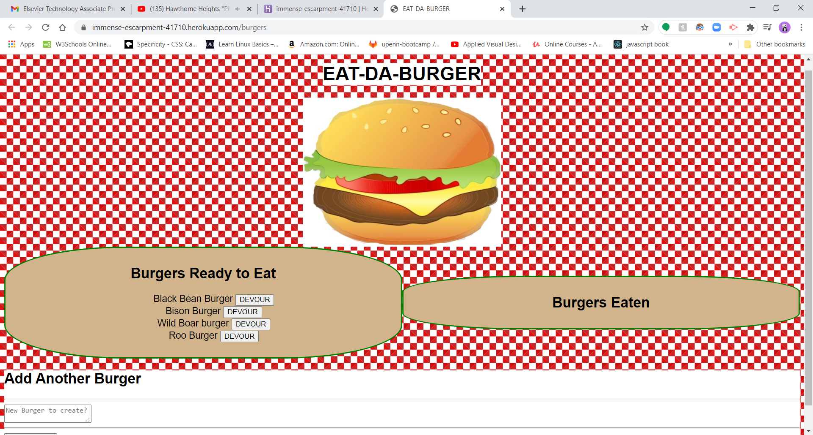

# Eater-App

[Link to Deployed app](https://immense-escarpment-41710.herokuapp.com/burgers)

## Description 

Eat-Da-Burger! is a restaurant app that lets users input the names of burgers they'd like to eat.

Whenever a user submits a burger's name, your app will display the burger on the left side of the page -- waiting to be devoured.

Each burger in the waiting area also has a `Devour it!` button. When the user clicks it, the burger will move to the right side of the page.

I create a burger logger with MySQL, Node, Express, Handlebars and a homemade ORM (yum!). I followed the MVC design pattern; use Node and MySQL to query and route data in the app, and Handlebars to generate HTML. The application will create burgers by taking in user input. They are then displayed on the html in a div and have a button to devour the burger. After you have devoured the burger it will move to div next to the first.  The last functionality to clear the plate and remove the burger from the database. 

### Table Of Contents

-[Description](#Description)

-[Technologies](#Technologies)
   
-[Usages](#Usages)

-[Visuals](#Visuals)

-[Credits](#Credits)

-[License](#License) 

## Technologies

Expand to see technologies used

## Javascript

I use the MVC model to put together this project. It starts with orm Object Relational Mapping. This makes use of sql language to query the data base, and also passes in parameters and callback function. From there, I made a javascript file that sets up functions from orm to pull data from the burger table. Then lastly, moving into controller folder that file is where all the routes are setup. 

### JQuery

I used jquery to help grab the data that the user input. It also gets other elements on the page, so that they can be manipulated. Each function that created has a corresponding route on the backend to help with the manipulation of the data being selected by the jQuery.

### Node

I used node to initialize package.json. After the initialization, I added mysql, express, express-handlebars.  Also used node to make a connection with the data base.  We also use it to spin up a server instance. 

### NPM

I used npm to install the following dependencies mysql, express-handlebars, and express. 

#### MYSQL

I use mysql to make a connections to the data base by running it through node. I made several queries to get specific data through separate functions. I also used helper functions to help with the readability of the data and also to help with passing multiple parameters.

#### Express

Express made coding this application much easier. I made use of the express function through a variable named route.  It helped to reduce the amount of code needed to make requests and responses.  

I built routes and stored them in the routes files. 

I used the express router function to make it easier to set up the requests.  In the html routes mainly made get requests to grab the html page that is stored in the views folder. Index is setup as the starting html. Other routes were created to handle user input.  I also used router was use to setup api routes and transfer user data to the database. I made use of post to get data and resend the incoming data and us the response to put it back on the html page with the help of our file system node application.  I did the same thing with the delete function.

### HTML

#### Handle Bars - express

I used two files to put together the html layouts and view. Main, that is located in layouts folder, is there to setup the reference to handlebars. So the rest of the html views will be injected to the main html. Index hbs is where I dynamically add the rest of our content for the page. 

### CSS

I used some basic css to setup the layout of the page. Looked up an easy what to create a checkered look and linked it below in my credits. I added a little color to some of the divs.

## Usages

Just for fun create odd or regular burgers and devour them. Also don't for get to clear your plate at the end or leave your mess for the next person to clean up. It's entirely up to you.

### Visuals

Screen Shots and Gif with Video link

 

Click on the gif to be linked to the video

## Credits

* [Node Documents](https://nodejs.org/api/index.html)
* [npm Documents](https://www.npmjs.com/)
* [Express.js](https://expressjs.com/)
* [Handlebars](https://handlebarsjs.com/guide/)
* [Stack Overflow](https://stackoverflow.com/)
* [W3Schools](https://www.w3schools.com/sql/default.asp)
* [GitHub Gist create checkered background](https://gist.github.com/dfrankland/f6fed3e3ccc42e3de482b324126f9542)

## License

MIT License

Copyright (c) 2020 David Wylie

## Contact

* [David Wylie Github](https://github.com/wyliedavid1984)